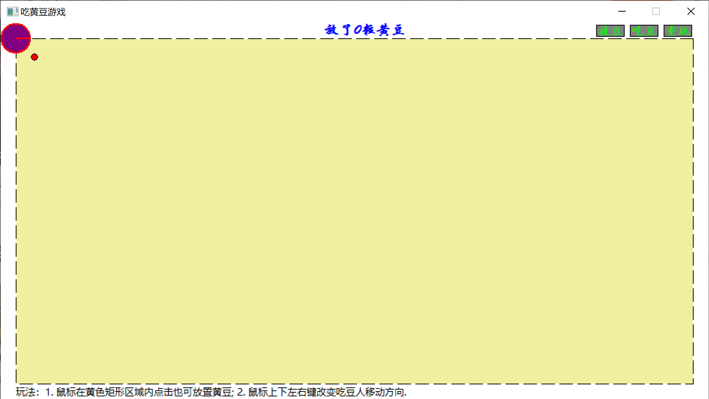

---
puppeteer:
  displayHeaderFooter: true
  headerTemplate: "<span style='font-size:6pt;font-family:\"楷体\";color:rgb(90, 90, 90);'>&emsp;吃豆游戏——设计文档</span>"
  footerTemplate: "<div style='width:100%;text-align:right;font-size:6pt;font-family:\"楷体\"'><span class='pageNumber'></span>/<span class='totalPages'></span>&emsp;&emsp;</div>"
  printBackground: true
  landscape: false
  format: "A4"
  margin:
    top: "50px"
    left: "50px"
    right: "50px"
    bottom: "50px"
---

# 吃豆游戏

## 题目要求

根据吃豆游戏, 构建由上下左右箭头控制的随机生成的豆（至少30颗）的吃法，要求最后把豆吃完.

## 简要功能介绍

### 1\. 界面绘制



如同, 黄色区域为放豆子的区域, 吃豆人初始位于左上方, 是一个紫色带红色边线的扇形, 靠近吃豆人右下方处有一粒红豆, 红色的豆子是虚拟的, 仅仅表示刚刚放下的黄豆的位置, 不算作被吃的豆子中.

### 2\. 放豆子操作

图中蓝色字体显示放置黄豆的数目, 点击右上角放豆按钮, 会随机放下30粒黄豆, 此外还可以用鼠标点击黄色区域任意放置黄豆, 无论采用何种方式放置黄豆, 黄豆总数不得少于30颗.

### 3\. 吃豆子操作

点击吃豆, 吃豆人开始以一个固定的速率向右移动, 这时候按下上下左右方向键会改变吃豆人的运动方向, 从而达到吃完所有黄豆的目的.

### 4\. 胜负判定

- 获胜: 在60秒内吃完所有黄豆.
- 失败
    1. 在60秒到达后, 没有吃完所有黄豆;
    2. 在吃豆的过程中, 吃豆人跑出了虚线包围的区域(虚线上是安全的).

## 关键代码

- 表示游戏状态的枚举值, `Put`, `Eat`, `Wait`分别代表放置黄豆、吃豆、吃豆结束(成功或失败)的状态.

    ```cpp
    enum class GameMode
    {
        Put, Eat, Wait
    };
    ```

- 两个简单的内联函数

    ```cpp
    // 获取两点距离的平方
    inline LONG get_distance_square(POINT& a, POINT& b)
    {
        return (a.x - b.x) * (a.x - b.x) + (a.y - b.y) * (a.y - b.y);
    }

    // 判断点是否在矩形内部
    inline BOOL point_in_rect(const POINT& pt, const RECT& rt)
    {
        return (rt.left <= pt.x) && (pt.x <= rt.right) && (rt.top <= pt.y) && (pt.y <= rt.bottom);
    }
    ```

- 两个定时器, `TIMER_MONSTER_MOVE`用于控制吃豆人的移动、黄豆数量的刷新, `TIMER_GAME_TIME_OUT`用于检查是否超时. 在鼠标左键单击按钮(矩形区域) `btn2` 后, 执行如下代码

    ```cpp
    else if (point_in_rect(pt, btn2))                       // 吃豆
    {
        if (mode == GameMode::Put && pts.size() > 1)
        {
            if (pts.size() < 31)
            {
                MessageBox(hWnd, TEXT("豆子不足30颗!"), TEXT("提示"), 0);
                break;
            }
            timeLeft = 60;
            pts.erase(pts.begin());
            mode = GameMode::Eat;
            //monster.x = monsterRadius * 2;
            //monster.y = monsterRadius * 2;
            SetTimer(hWnd, TIMER_MONSTER_MOVE, 100, 0);
            SetTimer(hWnd, TIMER_GAME_TIME_OUT, 1000, 0);
        }
    }
    ```

- 定时器 `TIMER_MONSTER_MOVE` 时间到达后会更新吃豆人的位置、嘴型、豆子被吃后的数量. 其中嘴型判断比较复杂, 需要用三角函数计算出从吃豆人中心向豆子作切线后两个切点的位置, 存储于静态变量 `static std::array<LONG, 4> mouseDirection;` 中, 计算切点坐标的代码如下

    ```cpp
    double distance;
    LONG temp;
    monster.x += monsterDX;
    monster.y += monsterDY;
    std::deque<POINT>::iterator iter = pts.begin();
    distance = get_distance_square(monster, *iter);  // 不开方, 减少运算
    if (distance > monsterRadius * monsterRadius)
        while (++iter != pts.end())
        {
            temp = get_distance_square(monster, *iter);
            if (temp < distance)
            {
                std::swap<POINT>(pts.front(), *iter);
                distance = temp;
            }
        }
    
    ...

    else if (distance <= (double)monsterRadius + (beanRadius * 2))              // 张嘴
    {
        double dx = pts.front().x - (double)monster.x;
        double dy = pts.front().y - (double)monster.y;
        double sin_sita = dx / distance;
        double cos_sita = dy / distance;
        double cos_phi = beanRadius / distance;
        double sin_phi = sqrt(dx * dx + dy * dy - (double)beanRadius * beanRadius) / distance;
        double sin_alhpa = sin_phi * cos_sita - cos_phi * sin_sita;
        double cos_alpha = cos_phi * cos_sita + sin_phi * sin_sita;
        double sin_beta = sin_phi * sin_sita - cos_phi * cos_sita;
        double cos_beta = cos_phi * sin_sita + sin_phi * cos_sita;

        mouseDirection = {
            pts.front().x + static_cast<LONG>(beanRadius * cos_beta),
            pts.front().y - static_cast<LONG>(beanRadius * sin_beta),
            pts.front().x - static_cast<LONG>(beanRadius * sin_alhpa),
            pts.front().y + static_cast<LONG>(beanRadius * cos_alpha)
        };
        InvalidateRect(hWnd, NULL, TRUE);
    }
    ```

    上述代码中排序的作用是找出下一刻即将和吃豆人相距最近的黄豆, 进而判断应该是张嘴还是吃豆, 在合适的距离内张嘴, 在合适的距离内吃豆.

- 定时器`TIMER_GAME_TIME_OUT`, 60s时间到达后若豆子没吃完, 判断玩家失败

    ```cpp
    case TIMER_GAME_TIME_OUT:
    {
        if (--timeLeft == static_cast<unsigned>(-1))
        {
            KillTimer(hWnd, TIMER_GAME_TIME_OUT);
            KillTimer(hWnd, TIMER_MONSTER_MOVE);
            mode = GameMode::Wait;
            MessageBox(hWnd, TEXT("时间已到, 游戏失败!"), TEXT("失败"), 0);
        }
        break;
    }
    ```

- 重玩游戏
    清除黄豆信息, 回到初始状态

    ```cpp
    else if (point_in_rect(pt, btn1))                        // 重玩
    {
        if ((mode == GameMode::Eat && !pts.size()) || mode == GameMode::Wait)
        {
            mode = GameMode::Put;
            pts.resize(1);
            pts.front() = { 2 * monsterRadius + beanRadius, 2 * monsterRadius + beanRadius };
            monster.x = monster.y = monsterRadius;
            mouseDirection = { monster.x + monsterRadius, monster.y, monster.x + monsterRadius, monster.y };
            monsterDX = monsterSpeed;
            monsterDY = 0;
            InvalidateRect(hWnd, NULL, TRUE);
        }
    }
    ```
