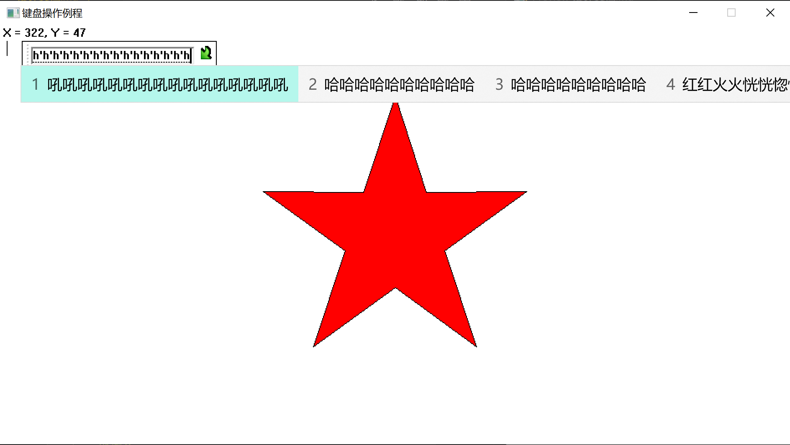

---
puppeteer:
  displayHeaderFooter: true
  headerTemplate: "<span style='font-size:6pt;font-family:\"楷体\";color:rgb(90, 90, 90);'>&emsp;文字编辑程序——设计文档</span>"
  footerTemplate: "<div style='width:100%;text-align:right;font-size:6pt;font-family:\"楷体\"'><span class='pageNumber'></span>/<span class='totalPages'></span>&emsp;&emsp;</div>"
  printBackground: true
  landscape: false
  format: "A4"
  margin:
    top: "50px"
    left: "50px"
    right: "50px"
    bottom: "50px"
---


# 文字编辑程序

## 题目要求

将课上的例题5-2增加如下功能：

1. 显示光标位置, 而且光标用特定的效果显示;
2. 解决回退键的功能问题;
3. 增加对F1键的功能操作, 当按下F1键时, 显示一段任意定义的帮助内容;
4. 增加<kbd>Ctrl</kbd>+<kbd>ALT</kbd>+<kbd>1</kbd>的自定义功能, 实现例题中所操作的字符串大小放大一倍的功能;
5. 增加<kbd>Ctrl</kbd>+<kbd>Shift</kbd>+<kbd>上下左右键</kbd>, 实现特定图形(比如圆形)的上下左右移动的操作

## 主要代码说明

- 显示鼠标位置
    在鼠标移动时, 会产生`WM_MOUSEMOVE`消息, 在响应处将鼠标的位置转换成字符串并绘制在界面上.

    ```cpp
    case WM_MOUSEMOVE:
        hDC = GetDC(hWnd);
        msg = (std::ostringstream() << " X = " << LOWORD(lParam) << ", Y = " << HIWORD(lParam) << "       ").str();
        TextOut(hDC, 0, 0, msg.c_str(), msg.length());
        ReleaseDC(hWnd, hDC);
        break;
    ```

- 显示光标, 更新光标位置
    在移动光标后使用`SetCaretPos((nArrayPos + 1) * nCharWidth, nLnHeight);`函数来及时更新光标位置, 在`WM_PAINT`消息的处理里面使用`HideCaret(hWnd);`和`ShowCaret(hWnd);`来隐藏和现实光标.

- 失去焦点后隐藏光标
    窗口失去焦点时, 不显示光标, 获取焦点时, 显示光标. 分别对`WM_SETFOCUS`和`WM_KILLFOCUS`消息来处理.

    ```cpp
    case WM_SETFOCUS:
        CreateCaret(hWnd, NULL, 1, nLnHeight);
        SetCaretPos((nArrayPos + 1) * nCharWidth, nLnHeight);
        ShowCaret(hWnd);
        break;
    case WM_KILLFOCUS:
        HideCaret(hWnd);
        DestroyCaret();
        nShiftDown = nCtrlDown = nAltDown = false;
        break;
    ```

- 输入汉字
    1. 基本原理:
        老师给的代码中, 本项目使用的是多字节字符集, 因此我没有把它改成Unicode(宽字节)字符集. 我们使用的都是中文系统, 所以系统多字节的编码是使用的中国的国家标准gbk, 在gbk编码中, 除了ASCII码外, 都是用两个字节来表示一个字符的, 所以, 汉字也是由两个字节组成. 因此, 我定义了一个静态变量`static unsigned char gbkCode = 0;`来表示第一个非ASCII码, 遇到第二个非ASCII码后就会和`gbkCode`组合成一个字符, 并显示到屏幕上.
    2. 特殊情况1
        如果我们遇到的第一个非ASCII码是缓冲区最后一个字节, 那么我们无法在缓冲区写入第二个非ASCII码字节, 这时候我们如果强行写入第一个字节, 那么屏幕上将会显示一个问号. 因此, 我们需要判剩余空间是否能够容纳完整的非ASCII码双字节.
    3. 特殊情况2
        中文输入法有一个特点, 就是能够一次性打出许多汉字后, 再完成输入, 比如下面我打出了多个`"吼"`字
        </img>
        但是这些字并没有直接输入到程序里面, 而是当我们按下空格键或者数字<kbd>1</kbd>后这些字符的各个字节才会被输入进去. 所以我们必须在判断字符完整性的同时判断剩余缓冲区的大小. 当我们最终按下空格键的时候, 这些字符的字节被一个接一个地快速地输入进去, 时间间隔非常短, 所以我们要防止出现顺序错乱的情况, 及时更新`gbkCode`和`outRight`的值(即不能先弹出"缓冲区已满"消息框再更新`gbkCode`和`outRight`, 而是要先更新`gbkCode`和`outRight`再弹出"缓冲区已满"消息框).
        > `outRight`代表缓冲区是否已满, 当`outRight`为`true`时, 不再响应字符输入消息, 以免一次性输入多个字符时出现反复弹窗, 直到用户删除字符后, `outRight`才变为`false`.
    4. 代码说明
        - 处理回退键, 注意区分ASCII和非ASCII字节以及是否到达字符串首即可.
        - 处理非ASCII字节, 每累积到两个非ASCII字节后, 就输入一个非ASCII字符.

        ```cpp
        case WM_CHAR:    //遇到非系统字符所作的处理
        {
            if (wParam == VK_BACK)  //处理“遇到回退键的消息”
            {
                if (nArrayPos == 0) //如果已经在一行文字的开始处，则提示用户"不能回退"
                    MessageBox(hWnd, "当前位置是文本的起始位置，不能回退", NULL, MB_OK);
                else
                {
                    n = isascii(cCharBuf[nArrayPos - 1]) ? 1 : 2;   // GBK编码中两个字节表示一个汉字
                    nArrayPos -= n; //每按一次回退键就回退一个字符的位置
                    nNumChar -= n;  //对现有字符总数进行计数
                    for (x = nArrayPos; x < nNumChar; ++x)
                        cCharBuf[x] = cCharBuf[x + n];
                    outRight = false;
                    InvalidateRect(hWnd, NULL, TRUE);  //刷新用户区，并向应用程序发送WM_PAINT消息
                }
                break;
            }
            if (wParam == VK_ESCAPE) //处理按下Escape键消息
            {
                SendMessage(hWnd, WM_CLOSE, 0, 0);  // 关闭窗口
                break;
            }
            if (!isascii(wParam))   // 处理非ASCII字节  
            {
                if (outRight) { break; }
                if (gbkCode)
                {
                    if (nNumChar + 2 > BufSize)
                    {
                        gbkCode = 0, outRight = true, MessageBox(hWnd, "缓冲区已满，不能再输入字符了\n若需要删除字符，请用BackSpace键", NULL, MB_OK);
                        break;
                    }
                    else
                    {
                        for (x = nNumChar + 1; x > nArrayPos; --x)
                            cCharBuf[x] = cCharBuf[x - 2];
                        cCharBuf[nArrayPos] = gbkCode;
                        cCharBuf[nArrayPos + 1] = (unsigned char)wParam;
                        gbkCode = 0;
                        nNumChar += 2;
                        nArrayPos += 2;
                        InvalidateRect(hWnd, NULL, TRUE);
                        break;
                    }
                }
                else
                {
                    gbkCode = (unsigned char)wParam;
                    break;
                }
            }
            if (nNumChar >= BufSize) //如果写入的字符数超过缓冲区大小，则报警
            {
                if (!outRight) outRight = true, MessageBox(hWnd, "缓冲区已满，不能再输入字符了\n若需要删除字符，请用BackSpace键", NULL, MB_OK);
                break;
            }
            outRight = false;
            for (x = nNumChar; x > nArrayPos; x = x - 1)
                cCharBuf[x] = cCharBuf[x - 1];
            cCharBuf[nArrayPos] = (unsigned char)wParam;
            ++nArrayPos;
            ++nNumChar;
            InvalidateRect(hWnd, NULL, TRUE);
        }
        break;
        ```

- 扩大字符串
    1. 用静态布尔值表示<kbd>Shift</kbd>, <kbd>Alt</kbd>, <kbd>Ctrl</kbd>等键是否按下.

        ```cpp
        static bool nCtrlDown = false, nAltDown = false, nShiftDown = false; 
        ...
        case WM_SYSKEYDOWN:
            nAltDown = true;
            break;
        case WM_SYSKEYUP:
            nAltDown = false;
            break;
        case WM_KEYDOWN:     //处理按下键消息
        {
            switch (wParam)
            {
                ...
            case VK_CONTROL:
                nCtrlDown = true;
                break;
            case VK_SHIFT:   //当按shift键时，变量置为真
                nShiftDown = true;
                break;
                ...
            }
        }
        case WM_KEYUP:       //处理释放键消息
            if (wParam == VK_CONTROL)
                nCtrlDown = false;
            else if (wParam == VK_SHIFT)
                nShiftDown = false;
            break;
        ```

        当<kbd>1</kbd>键被按下的时候, 判断<kbd>Alt</kbd>+<kbd>Ctrl</kbd>是否被按下, 如果是的话, 则创建一个新的字体, 大小为原来的2倍.当然, 一个字体不可能无限大, 并且`int`类型也有其最大大小, 不可能无限乘以2而不溢出, 所以我索性限制了字体的最大高度的4倍不得超过窗口高度.

        ```cpp
        case '1':
            if (!nCtrlDown || !nAltDown) break;
            if (nLnHeight * 4 > star[10].y)
            {
                MessageBox(hWnd, "高度限制, 不能再放大了!", "提示", 0);
                return TRUE;
            }
            nLnHeight *= 2;
            nCharWidth *= 2;
            DeleteObject(font);
            font = CreateFont(nLnHeight, nCharWidth, 0, 0, 0, 0, 0, 0, dwCharSet, 0, 0, 0, FIXED_PITCH, NULL);
            HideCaret(hWnd);
            DestroyCaret();
            CreateCaret(hWnd, NULL, 1, nLnHeight);
            ShowCaret(hWnd);
            InvalidateRect(hWnd, NULL, TRUE);
            return TRUE;
        ```

        对字符串的宽度没有严格的限制, 当字符串超出窗口时, 会显示一个水平滚动条.

- 图形移动
    图形我选择的是一个红色的五角星, 一开始位于用户区的中央, 再`WM_PAINT`里面我先绘制了五角星再绘制字符串, 所以五角星不会遮挡字符串, 而字符串的背景被设为透明, 所以字符串也不会对五角星造成很大影响. 与上面的组合键处理方法类似, 当方向键被按下时, 判断<kbd>Alt</kbd>+<kbd>Ctrl</kbd>是否被按下, 如果是则移动五角星, 如果不是则执行默认的处理. 另外, 这里的图形和字符串处理方式不一样, 五角星不能超出用户区.

    ```cpp
    case VK_LEFT: //处理按下左方向键时的消息
    if (nShiftDown && nCtrlDown)
    {
        if (star[2].x == 0) break;
        for (int i = 0; i < 10; i++)
            --(star[i].x);
        InvalidateRect(hWnd, NULL, TRUE); //用户区刷新
        break;
    }
    ```

- 帮助内容
    在`WM_KEYDOWN`里面给`wParam`的`switch`添加如下分支即可.

    ```cpp
    case VK_F1:
    MessageBox(hWnd, "按下Ctrl+ALT+1可将字符串大小放大一倍;\n按下Ctrl+Shift+(上下左右键), 五角星会上下左右移动.", "帮助", 0);
    return TRUE;
    ```
