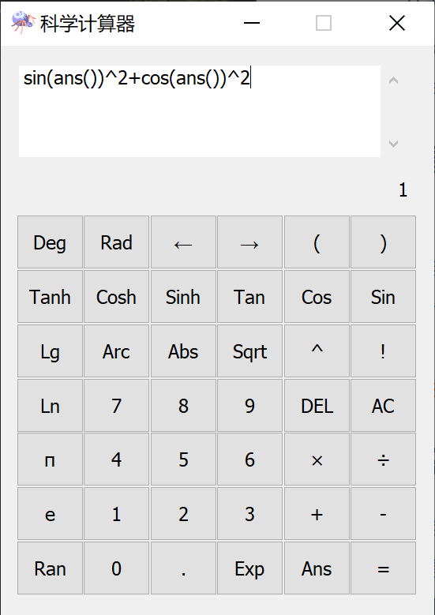

---
puppeteer:
  displayHeaderFooter: true
  headerTemplate: "<span style='font-size:6pt;font-family:\"楷体\";color:rgb(90, 90, 90);'>&emsp;科学计算器——设计文档</span>"
  footerTemplate: "<div style='width:100%;text-align:right;font-size:6pt;font-family:\"楷体\"'><span class='pageNumber'></span>/<span class='totalPages'></span>&emsp;&emsp;</div>"
  printBackground: true
  landscape: false
  format: "A4"
  margin:
    top: "50px"
    left: "50px"
    right: "50px"
    bottom: "50px"
---

# 科学计算器设计说明

[TOC]

## 一、题目要求

编写一个功能齐全的多功能科学计算器.

## 二、使用说明

### 1\. 输入方法

- [x] 键盘输入;
- [x] 点击界面上的按钮输入.

### 2\. 输入格式

1. 支持输入 `+-*/^().` 和 `'0'-'9'` , `'a'-'z'`, `'A'-'Z'`(自动转小写) 等字符;
2. 空格以及其他所有字符都会被视为 **"Invalid"**, 不会执行解析计算;
3. 输入时该加括号要加括号, 比如 `-2^3` 没加括号计算结果为 `-8` , `2^-1` 则是 Invalid ;
4. 不支持省略0的小数, 比如 `0.1` 不能写成 `.1`;
5. 不支持省略后括号, 比如 `(1+2)` 不能写成 `(1+2`, `sin(pi())` 不能写成 `sin(pi()` 或者 `sin(pi(`.

### 3\. 计算精度

1. 程序未对输入长度作出限制;
2. 小数采用c++内置的double类型, 数据最后1~3位可能出现错误, 属于正常现象;
3. 不建议输入超长的大数, 本程序未在大数运算方面做详细考虑(需要复杂的算法).

### 4\. 函数说明

1. 所有函数不支持传入超过一个参数;
2. 三角函数和双曲函数的反函数需要先点击 `Arc` 按钮, 然后再点击 `Sin` 等按钮, 或者直接输入字符串 `arcsin(` 等;
3. 三角函数收的参数**必须为弧度**, 如果是角度请先转换.
4. 弧度和角度的转换示例
    - 角度->弧度
        `rad(180)` 的计算结果为 `3.1415926...`
    - 弧度->角度
        `deg(pi())` 的计算结果为 `180`
5. 无参函数
    下列函数不支持传入参数
        - 圆周率: `pi()`
        - e: `e()`
        - 历史记录: `ans()`
        - `[0, 1]` 内**均匀分布**的随机数: `rand()`
6. `ans()` 历史记录函数
    - 初始记录为 0;
    - 历史记录并不是随时更新的, 需要按下**界面上**的 <kbd>=</kbd> 按钮或者**键盘上的**回车键或<kbd>=</kbd>键才会记录;
    - 输入算式错误的时候不会记录历史.

### 5\. 错误提示

- **Invalid**: 错误的算式;
- **Undefined**: 未定义的错误或者未定义的函数;
- **Wait**: 算式前面部分是正确的, 等待完成后面的;
- **nan**: x的范围超出定义域, 比如负数开方, 负数阶乘等;
- **inf**: 无穷大, 比如 `1/0`;
- **Null**: 空字符串或者错误的指针(一般情况界面不会显示).

### 6\. 特殊情况

1. 小数阶乘
    - 不支持感叹号计算阶乘, 需要使用 `fact()`函数计算阶乘;
    - 在本计算器中, 取小数阶乘为离这个小数最近的整数的阶乘.
2. 连续乘方
    比如 `2^3^4` , 默认从左至右计算, 即 `(2^3)^4`, 要想从右至左计算需要加括号;

### 7\. 键盘快捷键

1. <kbd>Enter</kbd>键或<kbd>=</kbd>键可以保存历史记录到`ans()`;
2. <kbd>Delete</kbd>键可以清空输入内容;
3. <kbd>Esc</kbd>键可以关闭计算器.

## 三、关键代码

- 整体思路
    1. 用MFC画一个界面, 由输入框, 输出框, 按钮这三部分组成 </img>

    2. 点击按钮或者用键盘可以在输入框输入算式, 输入框文字改变发送消息, 消息循环调用如下函数

    ```cpp
    void CCalculatorDlg::OnEnChangeEdit1()
    {
        CString text;
        m_formula.GetWindowText(text);
        if (!m_formula.GetWindowTextLength())
        {
            m_results.SetWindowText(NULL);
            return;
        }
        FormulaPaser<TCHAR> paser((const TCHAR*)text);
        m_results.SetWindowText(paser.outstr(false).c_str());
        m_formula.SetFocus();
    }
    ```

    其中, FormulaPaser 是一个类模板, 它可以用`char`或者`wchar_t`来偏特化, 这里用`TCHAR`, 可以灵活地根据宏定义来产生相对应的类. FormulaPaser 提供一个接口 `FormulaPaser::outstr(bool)` , 布尔值代表是否存储这次计算的值, 默认否.

- FormulaPaser **私有继承**自父类 _Base_FormulaPaser. _Base_FormulaPaser 可以把算式字符串解析成树形结构, 然后使用递归来从各个子节点计算到父节点, 得到算式最终的值, 而 FormulaPaser 只是对 _Base_FormulaPaser 进行了一些简单的包装, 所以这里主要分析 _Base_FormulaPaser 的设计思路.

- _Base_FormulaPaser 关键代码分析
    1. 错误状态
        枚举类型 `_Error_State` 代表了五种错误类型, `NoError` 代表没有错误出现.

        ```cpp
        enum _Error_State { NoError, Null, Undefined, Wait, Invalid };
        static int _error_state;
        ```

    2. 数据结构
        - 核心数据成员之一是一个 `std::vector<_Base_FormulaPaser>` 类型的`protected`成员`_son`, 它代表了这个算式拆分成的子算式所组成的vector.

            ```cpp
            std::vector<_Base_FormulaPaser> _son;
            ```

            例如, `1+2*3-4` 优先级最低的是`+`和`-`, 所以它被拆分成 `1`, `2*3`, `4`后, 构造出3个新的`_Base_FormulaPaser`子节点存储于`_son`中. `_son`的第二个元素也是一个`_Base_FormulaPaser`, 它代表算式`2*3`, 所以它把`2*3`拆分成`2`和`3`后存储在它的`_son`成员内.
        - 另一个比较重要的数据成员是一个`double`型的`_value`, 它默认被初始化为`std::numeric_limits<double>::quiet_NaN()`.
            在`_son`不为空的情况下, 这个值不起作用, 但是如果`_son`为空, `_value`就代表了这个节点的值. 比如, 当一个`_Base_FormulaPaser`解析字符串`"3.14"`的时候, 它会发现这不是一个复杂的表达式, 而是一个可以直接得出来的值, 所以它把`"3.14"`直接转换成`double`后存储在`_value`里面, 这时候它的`_son`就是空的.
        - 各种运算符的表示
            用一个成员变量`_operation`表示它的前一个成员应该对它调用的运算符.

            ```cpp
            // 分别代表加减除乘乘方和无(none) addition, subtraction, division, multiplication, power, none
            enum class Sign { A, S, D, M, P, N };
            Sign _operation = Sign::N;
            ```

            例如, 一个字符串`"1+sin(2)-4*5"`被分割为`1`, `sin(2)`, `4*5`, 那么`1`前面就是`Sign::N`, `sin(2)`前面就是`Sign::A`, `4*5`前面就是`Sign::S`.
        - 整体负号
            使用私有成员`int _negative;` 表示一个算式整体是否是负的, 它的值只会是 $1$ 或 $-1$ .
        - 整体函数

            ```cpp
            enum class Func { Def, Sin, Cos, Tan, Asin, Acos, Atan, Sinh, Cosh, Tanh, Asinh, Acosh, Atanh, Sqrt, Abs, Exp, Ln, Lg, Rad, Deg, Fact };
            Func _func = Func::Def;
            ```

            使用私有成员`_func` 表示包围一个算式的函数.

    3. 字符串解析
        - 方法: 字符串解析采用递归的方法, 由外及内, 逐层解析.
        - 参数类型`citerator`
            在类中使用`typdef`定义了迭代器的类型: `typedef typename  _String::const_iterator citerator;`
            具体来讲只有两种可能, 如果FormulaPaser模板的参数为`char`, 那么`citerator`就是`std::string::const_iterator`, 如果模板的参数为`wchar_t`, 那么`citerator`就是`std::wstring::const_iterator`;
        - 解析特点:
            不使用替换, 全过程采用常量迭代器, 不存在改动源字符串的现象, 也没有构造出新的字符串, 一直是在同一条字符串上解析.
        - 主要函数
            1. `citerator _parse_si(citerator begin, citerator end)`
                这个函数负责找出**字符串迭代器**`begin`之后、`end`之前的第一个最简单的、不可分割的表达式(这里称为==单一整体==). 例如, 假设`begin`和`end`之间的字符串为`"(1+2^3)*2+3"`, 由于括号内的是一个整体, 所以这个函数将返回的迭代器将指向`)`**的右边的字符**`*` ;
                为了说清楚什么是不可分割的表达式, 这里举出一些例子:
                | 字符串 | 返回值指向 |
                | -- | -- |
                | `"3*2^5-4"` | `3`后面的`*` |
                | `"5^0.4*(1-2)-6^sin(pi()/3)"` | `5`后面的`^` |
                | `"sin(pi())-1"` | `"sin(pi())"`后面的`-` |

                > 函数和括号一样, 视作一个单一整体.

            2. `citerator _parse_md(citerator begin, citerator end)`
                这个函数将运算级最低`+-`视为分隔符, 把由`*/^`相连的**单一整体**视为一个整体(这里称作==二级整体==), 返回`begin`后面的第一个二级整体的下一个字符的迭代器.
                例如传入`"2^3*(4-3)+1-0.5*2.3"`的`begin`和`end`之后, 该函数将返回一个迭代器指向`"2^3*(4-3)"`后面的`+`.
            3. `citerator _parse_pw(citerator begin, citerator end)`
                这个函数将运算级第二低的`+-*/`视为分隔符, 把由`"^"`相连的所有**单一整体**视为一个整体(这里称作==三级整体==), 返回`begin`后面的第一个三级整体的下一个字符的迭代器.
                例如传入`"3^(4-1)^0.5*2-0.3*3.2"`的`begin`和`end`之后, 该函数将返回一个迭代器指向`"3^(4-1)^0.5"`后面的`*`.
            4. `void _parse_val(citerator begin, citerator end)`负责**拆分一个单一整体**, 例如`sin(1*2+3^4)`会被拆去`sin()`函数, 进一步解析其中的表达式`1*2+3^4`; 而一个简单的表达式, 比如`3`则会被直接解析成`double`类型的值存储在`_vlaue`中.
            5. `void _parse_all(citerator begin, citerator end)`
                该函数负责循环调用以上诸`_parse_`开头的函数, 从而以当前表达式的优先级最低级的运算符为界限解析出一层, 解析的过程中有递归, 所以一层一层解析下去就完成了整个算式的解析.
    4. 最终结果计算

        ```cpp
        double calculate()
        {
            if (!_son.size()) return _negative * Function[static_cast<int>(_func)](_value);
            auto iter = _son.begin();
            double q = iter->calculate();
            while (++iter != _son.end())
            {
                switch (iter->_operation)
                {
                case Sign::A:
                    q += iter->calculate();
                    break;
                case Sign::S:
                    q -= iter->calculate();
                    break;
                case Sign::M:
                    q *= iter->calculate();
                    break;
                case Sign::D:
                    q /= iter->calculate();
                    break;
                case Sign::P:
                    q = pow(q, iter->calculate());
                default:
                    break;
                }
            }
            return _negative * Function[static_cast<int>(_func)](q);
        }
        ```

        这里又用到了递归, 如果`_son`为空, 则直接返回函数作用于`_value`后的值(同时考虑`_negative`), 如果`_son`不为空, 则逐个调用每个子节点的`calculate()`函数, 并用它们的运算符把它们的结果累积起来.得到最终结果.
    5. 输出字符串

        ```cpp
        _String outstr(bool remember = false)
        {
            switch (_error_state)
            {
            case _Error_State::Null:
                return { 'N', 'u', 'l', 'l', '\0' };
            case _Error_State::Undefined:
                return { 'U', 'n', 'd', 'e', 'f', 'i', 'n', 'e', 'd', '\0' };
            case _Error_State::Invalid:
                return { 'I', 'n', 'v', 'a', 'l', 'i', 'd', '\0' };
            case _Error_State::Wait:
                return { 'W', 'a', 'i', 't', '\0' };
            case _Error_State::NoError:
                return (_Ostream()
                 << std::setprecision(16)
                 << (remember ? (_ans = calculate()) : calculate())
                 ).str();
            default:
                return (_Ostream() 
                 << std::setprecision(16)
                 << _value
                 ).str();
            }
        }
        ```

        如果出错则输出相应的错误, 如果没有错误则输出相应的字符串.
