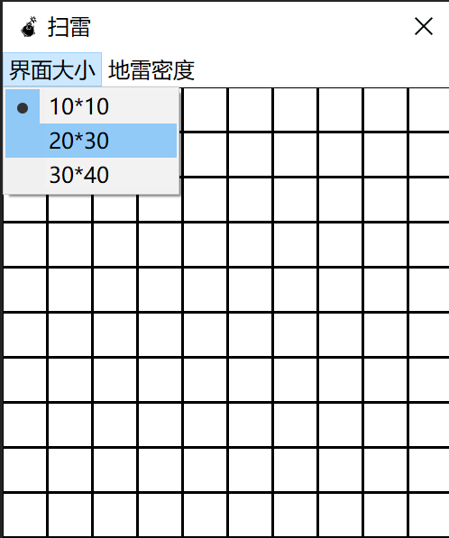

---
puppeteer:
  displayHeaderFooter: true
  headerTemplate: "<span style='font-size:6pt;font-family:\"楷体\";color:rgb(90, 90, 90);'>&emsp;扫雷游戏——设计文档</span>"
  footerTemplate: "<div style='width:100%;text-align:right;font-size:6pt;font-family:\"楷体\"'><span class='pageNumber'></span>/<span class='totalPages'></span>&emsp;&emsp;</div>"
  printBackground: true
  landscape: false
  format: "A4"
  margin:
    top: "50px"
    left: "50px"
    right: "50px"
    bottom: "50px"
---


# 扫雷游戏

## 题目要求

- 编写一个挖地雷应用程序;
- 通过菜单项可以选择界面矩阵为10\*10、20\*30、30\*40三种;
- 挖雷界面是在一个对话框中, 由菜单项触发, 然后开始挖地雷游戏;
- 地雷阵随机生成;
- 要求可以清晰的分辨出待翻开的结点、地雷标记、非地雷标记等;
- 用鼠标进行相应的挖雷操作;
- 挖成功或炸雷产生失败时候显示所用时间.

## 功能说明

- 选择界面
    进行如图所示操作即可
    </img>
- 选择地雷密度
    地雷密度: 是指有随机一个格子里面有地雷的概率(实际地雷总数量除以方格总数不一定严格等于地雷密度)
    > 改变地雷密度会刷新界面, 重新开始一局游戏.
- 重新开始一局的方法
    方法一: 更换界面大小(如果界面大小和上一次选的一样, 不会重新开始游戏)
    方法二: 重新选择一次地雷密度(即使和上一次选的一样, 也会重新开始一局新游戏)
- 胜负判断
    1. 胜利: 所有的非地雷格子都被挖开, 并且所有的地雷被插上旗帜, 玩家获胜;
    2. 失败: 玩家不小心挖到了地雷.

## 代码逻辑分析

- 挖地雷界面是一个**对话框**, 即`CMineClearanceDlg`类, 它有菜单可以选择界面的小和地雷密度.
- `CMineClearanceDlg`类有几个重要的成员变量
    1. `UINT _diff = 1;`
        `_diff`代表了游戏的困难程度, 也就是地雷密度, 这里的1代表默认地雷密度是`0.1`.
    2. `std::vector<std::vector<MineButton>> m_BtnS;`
        `m_BtnS`是一个二维的`std::vector`, 它就是所有格子组成的矩阵, 每一个格子是一个按钮, 也就是`MineButton`的一个对象, 而`MineButton`继承了`CButton`.
- `CMineClearanceDlg`成员函数
    1. `void UpdateGame(bool erase=true);`
        这个函数用来刷新界面.
        - 如果玩家改变了界面大小, 则`erase`将为`true`, 函数执行后会清除掉所有的按钮, 重新构造出新的按钮和局面.
        - 如果玩家仅仅选择了地雷密度, 没有改变界面大小, 则不会清除现有的按钮, 而是把所有的按钮信息更新一遍, 从而达到重来一局的效果.
    2. `afx_msg void OnGameSize(UINT nID);`
        当玩家选择界面大小时, 会调用该函数, 它会视情况更新界面大小, 如果玩家点击的大小就是当前的大小, 它不会做出任何更改, 如果玩家点击的大小不是当前的大小, 它会刷新相关数据, 并调用`UpdateGame(true)`, 同时刷新界面.
    3. `afx_msg void OnGameDiff(UINT nID);`
        当玩家选择地雷密度时, 会调用该函数, 该函数会更新`_diff`信息, 并且调用`UpdateGame(false)`.
- 按钮`MineButton`类
    1. 在`MineButton`类中, 用一个成员变量`type`来表示该方格的信息, `type`的类型是枚举类型`MineType`, 定义如下:

        ```cpp
        // 地雷未挖开, 地雷挖开, 空格未挖开, 空格挖开, 旗插在地雷上, 旗插在空格上
        enum class MineType
        {
            MaskMine, Mine, MaskNumber, Number, FlagMine, FlagNumber
        };
        ```

    2. 重写了鼠标消息函数

        ```cpp
        afx_msg void OnLButtonDown(UINT nFlags, CPoint point);  //鼠标按下
        afx_msg void OnRButtonDown(UINT nFlags, CPoint point);
        ```

        - 鼠标左键按下时, 判断点击的按钮的`type`, 并进行相关的操作;
        - 鼠标右键按下时, 判断该按钮的`type`, 并进行相关的操作.

    3. 重写了按钮绘制函数

        ```cpp
        virtual void DrawItem(LPDRAWITEMSTRUCT /*lpDrawItemStruct*/);  //绘制按钮
        ```

        每次刷新按钮时, 就会调用该函数, 该函数会根据`type`的类型绘制按钮的样式.

        | `type`类型 | 按钮样式 |
        | :--------: | :-----: |
        | `MaskMine` |   带黑色边框的空白正方形 |
        | `MaskNumber` | ^^ |
        | `Mine` | 地雷, 一个黑色圆形 |
        | `Number` | 数字, 周围地雷的数目 |
        | `FlagMine` | 旗帜, 一个黑色的小旗子 |
        | `FlagNumber` | ^^ |

    4. `MineButton::getMineNumber()`函数
        该函数会计算该格子周围的地雷的数目, 为了避免分类讨论, 一开始就在`CMineClearanceDlg::m_BtnS`里面把局面往四周扩充了一个空行, 例如`10x10`的界面被扩充为为`12x12`, 扩充的这些按钮不会显示出来, 因为没有对它们调用`CButton::Create()`函数.
    5. `MineButton::OpenSquare()`函数
        该函数负责显示被挖开的格子, 并且如果它没有被挖开过, 本身不是地雷, 而且周围没有地雷, 就会向四周拓展: 对周围8个格子调用`OpenSquare()`函数.
    6. 成员变量
        - 表示该按钮所处位置的: `std::size_t indexX = 0, indexY = 0;`
        - 表示游戏状态的: `static bool game_unstart, game_finished;`
            前者表示游戏是否开始, 后者表示游戏是否结束.
        - 表示游戏进行时间的: `static std::time_t game_time;`
            > 当玩家挖开第一个格子或者标记第一个格子的时候, 游戏开始计时; 当玩家失败或胜利时, 游戏停止计时.
        - 表示界面大小的: `static unsigned size;`
            该变量的低八位表示界面高度, 紧接着的八位表示界面宽度.
        - 指向整个局面的指针: `static std::vector<std::vector<MineButton>>* ptr;`
            `ptr`指向的就是`CMineClearanceDlg`的成员变量`m_BtnS`.

- 判断输赢
    由于输赢都是在玩家鼠标点击格子产生的, 所以需要在`OnLButtonDown` 和 `OnRButtonDown`里面判断输赢.
    1. 如果左键点击的格子的属性是`MaskMine`, 显然是玩家熟了, 停止游戏, 标记`game_finished`为`true`, 鼠标事件不再响应; 如果点击的格子是空白, 则判断是否所有格子都被挖开, 以及是否所有的旗都插在了未挖开的地雷上, 如果是, 则玩家胜利, 标记`game_finished`为`true`, 鼠标事件不再响应; 如果是其它情况, 则表示游戏还未结束.
    2. 如果右键点击的格子是最后一个未执行操作的格子, 那并且所有的标记都是正确的, 那么玩家获胜, 标记`game_finished`为`true`, 鼠标事件不再响应; 反之则游戏未结束.
